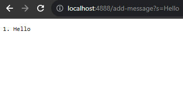
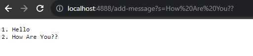
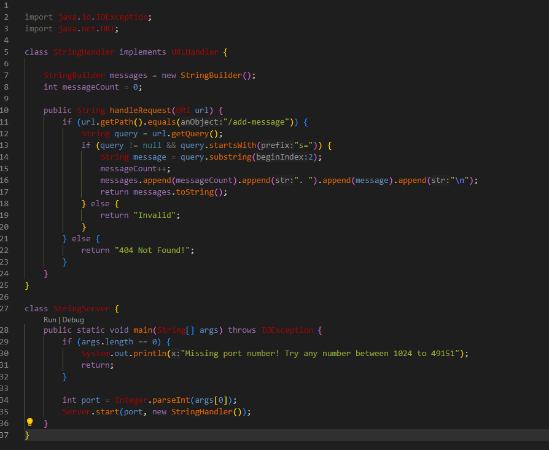
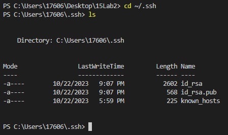
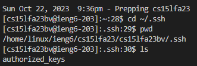
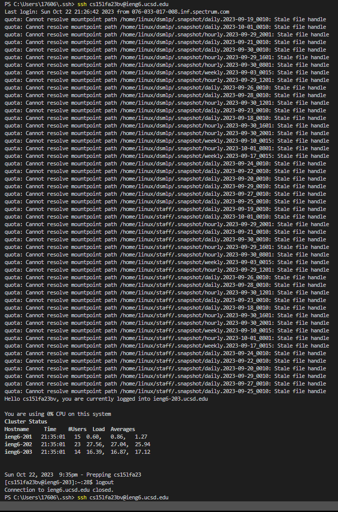

### Lab-Report-2---Servers-and-SSH-Keys-Week-3-
# Part 1
### First Message Addition

### Second Message Addition

### My Code 
(I based my code entirely off of the NumberServer.java file from wavelet)

# Part 2

#### The path to the *private* key:

> C:\Users\17606\.ssh\id_rsa

#### The path to the *public* key:

>  /home/linux/ieng6/cs15lfa23/cs15lfa23bv/.ssh/authorized_keys

#### My login did not ask for my password!!

# Part 3

I learned that there are ieng6 accounts for students and staff at my  university that I can run and save files to. It is amazing that I am capable of running on a remote computer in the Basement Computer Lab!
In the future I know I will use this feature consistantly as it will allow me to work on multiple devices at ease. 
