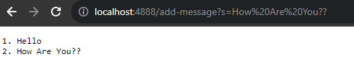
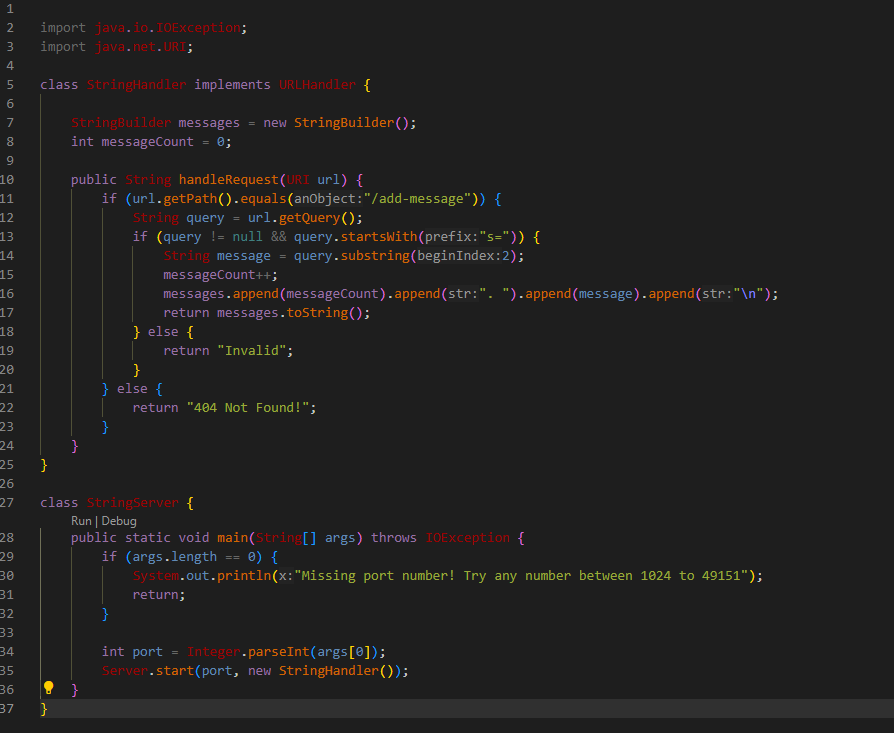
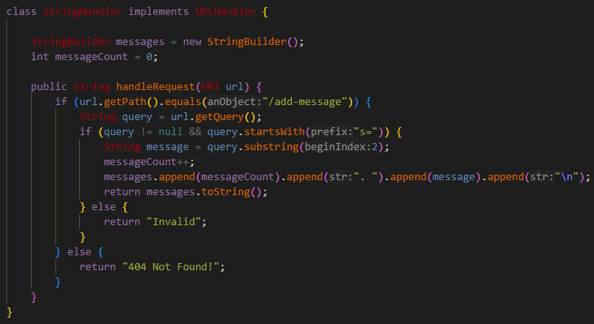

### Lab-Report-2---Servers-and-SSH-Keys-Week-3-
# Part 1
### Initially: additon messageCount = 0 and messages is empty since nothing has been added yet.

### First Message Addition

#### messageCount = 1 and messages = "1. Hello\n" 
#### The /add-message request matches the expected path so it calls for public String handleRequest(URI url), adding the string to messages and incrementing the messageCount.

### Second Message Addition

#### Similarly,  messageCount = 2 and messages = "1. Hello\n 2. How are you??"
#### The /add-message request matches the expected path so it calls for public String handleRequest(URI url), adding the string to messages and incrementing the messageCount.

### My Code 
(I based my code entirely off of the NumberServer.java file from wavelet)

### Methods:

#### public String handleRequest(URI url) : This method is called by the StringHandler class, if the path includes /add-message it checks for the 's=' query to append whatever string follows. If the query is invalid it outputs an error message. This method keeps track of the number of messages as an integer. "Invalid" is returned when the input includes **/add-message** but does not contain **s=**. "404 Not Found!" is returned.

#### public static void main(String[] args) throws IOException: This method is called by the StringServer class. This method checks for a valid port number as an integer and starts the requested server to that port number, if invalid it will throw an error message.
#### An invalid input may look like: java StringServer 1023, or java StringServer 50000000, or java StringServer (an empty request); as this class expects an input for args to be between 1024 to 49151. This does not start the server.
#### A valid input may look like: java StringServer 4000, and this will start the server from the terminal.

# Part 2

#### The path to the *private* key:

> C:\Users\17606\.ssh\id_rsa

#### The path to the *public* key:

>  /home/linux/ieng6/cs15lfa23/cs15lfa23bv/.ssh/authorized_keys

#### My login did not ask for my password!!

# Part 3

I learned that there are ieng6 accounts for students and staff at my  university that I can run and save files to. It is amazing that I am capable of running on a remote computer in the Basement Computer Lab!
In the future I know I will use this feature consistantly as it will allow me to work on multiple devices at ease. 
